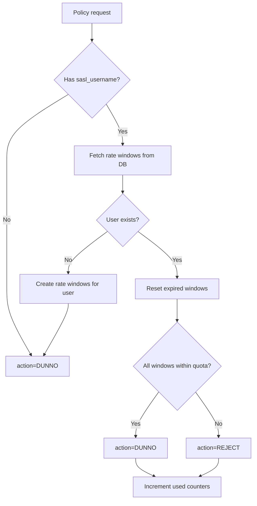

# policyd-rate-limit

[](https://crates.io/crates/policyd-rate-limit)
[](https://github.com/nbari/policyd-rate-limit/actions/workflows/test.yml)

Postfix rate limiter SMTP policy daemon

# How it works

It depends on the [Postfix policy delegation protocol](http://www.postfix.org/SMTPD_POLICY_README.html), it searches for the `sasl_username` and based on the defined limits stored in a SQL(MySQL/PostgreSQL/SQLite) database it rejects or allows `action=DUNNO` the email to be sent.



# How to use

```txt
Postfix policy daemon for rate limiting

Usage: policyd-rate-limit [OPTIONS] --dsn <dsn>

Options:
  -s, --socket <SOCKET>  Path to the Unix domain socket [default: /tmp/policy-rate-limit.sock]
      --dsn <dsn>        Database connection string [env: DSN=]
      --pool <pool>      Pool size for database connections [default: 5]
  -l, --limit <limit>    Maximum allowed messages per rate window (repeatable, default: 10)
  -r, --rate <rate>      rate in seconds for each window (repeatable, default: 86400)
  -v, --verbose...       Increase verbosity, -vv for debug
  -h, --help             Print help
  -V, --version          Print version
```

Repeat `--limit` and `--rate` to configure multiple windows, for example:

```
policyd-rate-limit --dsn ... -l 7 -r 3600 -l 100 -r 86400
```

All configured windows are enforced together: a request is allowed only when *every* window
is still under quota. This means the most restrictive window effectively caps traffic.

## Migration notes (1.0.2+)

The `ratelimit` table now uses a composite primary key `(username, rate)` to support multiple
windows per user. Migrate existing tables as follows:

Postgres:

```sql
ALTER TABLE ratelimit ALTER COLUMN rate SET NOT NULL;
ALTER TABLE ratelimit DROP CONSTRAINT ratelimit_pkey;
ALTER TABLE ratelimit ADD PRIMARY KEY (username, rate);
```

MariaDB/MySQL:

```sql
ALTER TABLE ratelimit MODIFY rate INT UNSIGNED NOT NULL DEFAULT 0;
ALTER TABLE ratelimit DROP PRIMARY KEY;
ALTER TABLE ratelimit ADD PRIMARY KEY (username, rate);
```

SQLite (recreate table):

```sql
CREATE TABLE ratelimit_new (
  username TEXT NOT NULL,
  quota INTEGER NOT NULL DEFAULT 0,
  used INTEGER NOT NULL DEFAULT 0,
  rate INTEGER NOT NULL DEFAULT 0,
  rdate TIMESTAMP NOT NULL DEFAULT CURRENT_TIMESTAMP,
  PRIMARY KEY (username, rate)
);
INSERT INTO ratelimit_new (username, quota, used, rate, rdate)
SELECT username, quota, used, rate, rdate FROM ratelimit;
DROP TABLE ratelimit;
ALTER TABLE ratelimit_new RENAME TO ratelimit;
```

The database schema (postgres example, one row per rate window):

```sql
CREATE TABLE IF NOT EXISTS ratelimit (
    username VARCHAR(128) NOT NULL, -- sender address (SASL username)
    quota INTEGER NOT NULL DEFAULT 0, -- limit
    used INTEGER NOT NULL DEFAULT 0, -- current recipient counter
    rate INTEGER NOT NULL DEFAULT 0, -- seconds after which the counter gets reset
    rdate TIMESTAMP WITHOUT TIME ZONE NOT NULL DEFAULT CURRENT_TIMESTAMP, -- datetime when counter was reset
    PRIMARY KEY (username, rate)
);
```

# Postfix configuration

Add the path of the policy-rate-limit socket to `smtpd_sender_restrictions` for example:

    smtpd_sender_restrictions: check_policy_service { unix:/tmp/policy-rate-limit.sock, default_action=DUNNO }

> check the perms of the socket
